# Building *Observable* Go Services

#### [GopherCon Turkey](https://gophercon.ist/en) - 2020

Note:

- Hello everyone
- BREATH
- Today I'm gonna talk about observability.
- Hopefully at the end of the talk you will have an idea about what is observability
- And how to build observable Go services
- BREATH
- First, who am I?

---?image=assets/img/avatar.compressed.jpg&position=right&size=48% 100%

@snap[north-west span-40 text-left text-07]

### Who am I?

@snapend

@snap[west span-60 text-left text-07]
SWE/SRE **@Red Hat**
Observability Platform Team
**Thanos** Maintainer
**Promethues** Contributor

@snapend

@snap[south-west span-50 text-left text-07]
@fa[twitter] kkakkoyun
@fa[github] kakkoyun
@snapend

Note:

- My name is Kemal
- And I work for Red Hat as a software engineer at Red Hat
- My team is responsible of building a platform to collect and store observability, signals such as metrics, logs, tracing and profilling.
- BREATH
- This platform is made of all Open source tools and projects.
- So we all contribute to them.
- BREATH
- As a team we also have SRE responsibilities, we are on-call for the platform that we are building
- So we are already using the practices that I'm gonna show today
- BREATH
- Also I'm a Thanos maintainer and recently started to contribute Prometheus,
- Besides observability and monitoring topics, I'm also passionate about distributed systems and databases
- I participate in SIG Observability and Kubernetes SIG Instrumentation

---

### What is **Observability?**

---

@quote[In control theory, observability is a measure of how well internal states of a system can be inferred from knowledge of its external outputs.](Wikipedia)

Note:

- It is basically an ability to ask questions to your running system.
- Is the system currently healthy?
- If not, why not? Where can we begin debugging?
- So that it could help us to troubleshoot our system when it is needed.

---

[Observability 101 @fa[external-link]](https://www.youtube.com/watch?v=6XkWkd3j5fI)

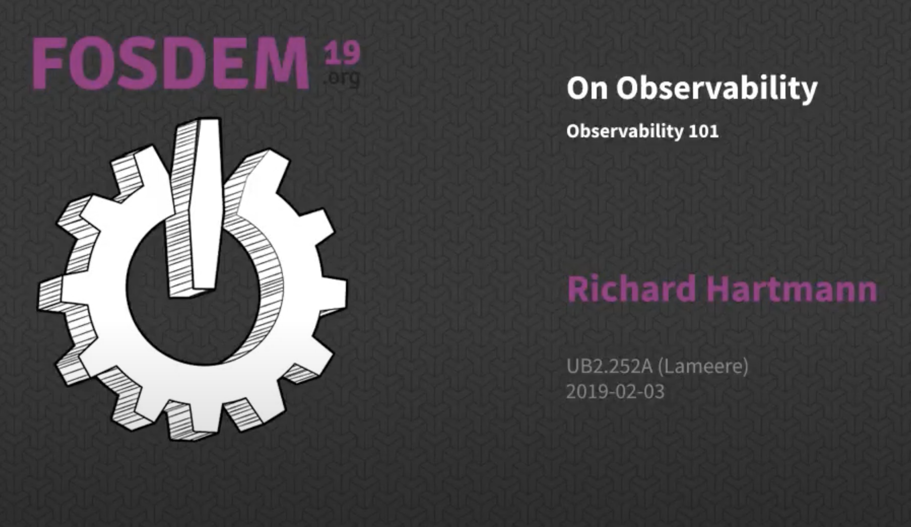

Note:

- You can check this amazing talk if you want to dig more on what observability is.

---

### What does a properly **observable system** in Go look like?

Note:

- For most of our systems, good observability is simply more important than good testing,
- because good observability enables smart organizations to focus on fast deployment and rollback.
- I guess there’s no single answer, no package I can tell you to import to solve the problem once and for all.
- The observability space is fractured, with many vendors competing for their particular worldview.

---

### The Pillars of **Observability**

Note:

- The Three pillars of Observability
- Aggregated Observations
- Discreate Events

---?image=assets/img/pillars_with_background.png&size=65%

Note:

- Metrics: Numerical data, easy to scale, you can do math with them
- Logs: Mostly test, rich with metadata, scales linearly, can be noisy sometimes
- Traces: Execution path of your program, Annotated, Rich, but extremely expensive

- Metrics: Good for alerting, dashboards and expolaration
- Logs: for establishing order of events, detailed information
- Traces: Useful to understand the system and why individual systems behaves as it is

---

[Metrics, tracing, and logging @fa[external-link]](https://peter.bourgon.org/blog/2017/02/21/metrics-tracing-and-logging.html)

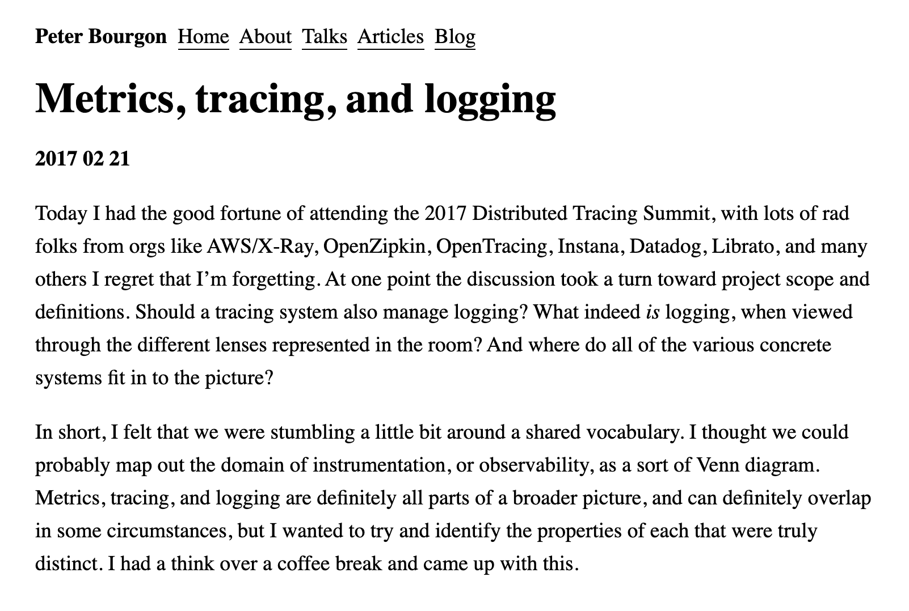

Note:

- You can more on this at following link.

---

### Everything starts with **Instrumentation**

Note:

- Everything starts with Instrumentation
- So we will do so!

---?image=assets/img/arch_diagram_with_background.png&size=80%

Note:

- We will work on a demo application that conform prometheus remote write protocol

---?image=assets/img/scrape_with_background.png&size=80%

### Health checks

Note:

- Providing a basic health check for our system always helps
- and it is a very low hanging fruit
- so lets add it

---

```golang
// NewServer creates a new internal server that exposes debug probes.
func NewServer(reg prometheus.Gatherer, listen, healthcheckURL string) *http.Server {
	// Internal server to expose introspection APIs.
	mux := http.NewServeMux()

	// Initialize health checks.
	healthchecks := healthcheck.NewHandler()

	// Register health check endpoints.
	mux.Handle("/-/healthy", http.HandlerFunc(healthchecks.LiveEndpoint))
	mux.Handle("/-/ready", http.HandlerFunc(healthchecks.ReadyEndpoint))

	return &http.Server{
		Addr:    listen,
		Handler: mux,
	}
}
```

Note:

- We will expose a dedicated http server for debugging events
- and it will check our public server

---

```console
➜ curl localhost:8081/-/heathy
{
    "http": "OK"
}

➜ curl localhost:8081/-/ready
{
    "http": "OK"
}
```

Note:

- So these endpoint could be used by our infrastructure to do its magic
- Like routing traffic or restarting in-case of a failure.

---

[metalmatze/signal @fa[external-link]](https://github.com/metalmatze/signal)

[heptio/healthcheck @fa[external-link]](https://github.com/heptiolabs/healthcheck)

Note:

- Useful libraries, if you don't want to reinvent the wheel

---

### Metrics

---


Note:

- As we talked about earlier, cheapest of the signals
- And it is relatively easy to add
- For this we will use prometheus

---

[Prometheus @fa[external-link]](https://prometheus.io/)

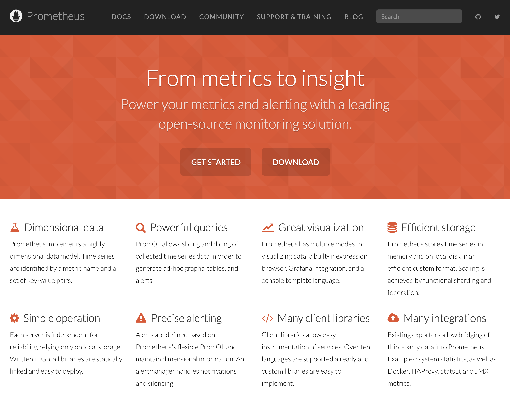

Note:

- Prometheus is a free software application used for event monitoring and alerting.
- A graduated CNCF project.

---

[prometheus/client_golang @fa[external-link]](https://github.com/prometheus/client_golang)

---

```golang
package main

import "github.com/prometheus/client_golang/prometheus"

func main() {
    // Start metric registry.
    reg := prometheus.NewRegistry()

    // Register metrics server.
    http.Handle("/metrics", promhttp.HandlerFor(reg, promhttp.HandlerOpts{}))
    http.ListenAndServe(":8080", nil)
}
```

---

```console
➜ curl localhost:8081/metrics
# HELP go_gc_duration_seconds A summary of the pause duration of garbage collection cycles.
# TYPE go_gc_duration_seconds summary
go_gc_duration_seconds{quantile="0"} 0
go_gc_duration_seconds{quantile="0.25"} 0
go_gc_duration_seconds{quantile="0.5"} 0
go_gc_duration_seconds{quantile="0.75"} 0
go_gc_duration_seconds{quantile="1"} 0
go_gc_duration_seconds_sum 0
go_gc_duration_seconds_count 0
...
```

---

```golang
import (
	"github.com/povilasv/prommod"
	"github.com/prometheus/common/version"
)

serviceName = "observable_remote_write_backend"

func main() {
    reg := prometheus.NewRegistry()

    // Register standard Go metric collectors, which are by default registered when using global registry.
    reg.MustRegister(
        prometheus.NewGoCollector(),
        version.NewCollector(serviceName),
        prommod.NewCollector(serviceName),
        prometheus.NewProcessCollector(prometheus.ProcessCollectorOpts{}),
    )
    ...
}
```

---?image=assets/img/prom_build_info.png&size=50%

---?image=assets/img/prom_go_collector.png&size=25%

---?image=assets/img/prom_mod_info.png&size=80%

---

@snap[north span-100]
#### Power of Middlewares
@snapend

```golang
package middleware

import (
	"github.com/prometheus/client_golang/prometheus"
)

type MetricsMiddleware struct {
	requestDuration *prometheus.HistogramVec
	requestSize     *prometheus.SummaryVec
	requestsTotal   *prometheus.CounterVec
	responseSize    *prometheus.SummaryVec
}
```

---

@snap[north span-100]
#### Power of Middlewares
@snapend

```golang
    requestDuration: promauto.With(reg).NewHistogramVec(
        prometheus.HistogramOpts{
            Name:    "http_request_duration_seconds",
            Help:    "Tracks the latencies for HTTP requests.",
            Buckets: []float64{0.001, 0.01, 0.1, 0.3, 0.6, 1, 3, 6, 9, 20, 30, 60, 90, 120},
        },
        []string{"code", "handler", "method"},
    ),

    requestSize: promauto.With(reg).NewSummaryVec(
        prometheus.SummaryOpts{
            Name: "http_request_size_bytes",
            Help: "Tracks the size of HTTP requests.",
        },
        []string{"code", "handler", "method"},
    ),
```

---

@snap[north span-100]
#### Power of Middlewares
@snapend

```golang
import (
	"github.com/prometheus/client_golang/prometheus"
	"github.com/prometheus/client_golang/prometheus/promauto"
	"github.com/prometheus/client_golang/prometheus/promhttp"
)

func (ins *MetricsMiddleware) NewHandler(handlerName string) func(next http.Handler) http.Handler {
	return func(handler http.Handler) http.Handler {
		return promhttp.InstrumentHandlerDuration(
			ins.requestDuration.MustCurryWith(prometheus.Labels{"handler": handlerName}),
			promhttp.InstrumentHandlerRequestSize(
				ins.requestSize.MustCurryWith(prometheus.Labels{"handler": handlerName}),
					promhttp.InstrumentHandlerResponseSize(
						ins.responseSize.MustCurryWith(prometheus.Labels{"handler": handlerName}),
						handler,
					),
				),
		)
	}
}
```

---

@snap[north span-100]
#### Power of Middlewares
@snapend

```golang
metrics := middleware.NewMetricsMiddleware(reg)

// Main server to listen for public APIs.
mux := http.NewServeMux()
mux.Handle("/receive",
    metrics.NewHandler("receive")(receiver.Receive),
)

srv := &http.Server{
    Addr:    cfg.server.listen,
    Handler: mux,
}

srv.ListenAndServe()
```

---?image=assets/img/prom_ui.png&size=90%

---

[Go Instrumentation Best Practices @fa[external-link]](https://are-you-testing-your-observability.now.sh/)


---

### Logs

---


Note:

- For log files to be machine-readable more advanced functionality, they need to be written in a structured format that can be easily parsed.
- Structured logging can be used for a couple different use cases:
- Process log files for analytics
- Searching log files

---

[go-kit/logger @fa[external-link]](https://github.com/go-kit/kit/tree/master/log)

[uber/zap @fa[external-link]](https://github.com/uber-go/zap)

Note:

- TODO

---

```golang
func NewLogger(logLevel, logFormat, debugName string) log.Logger {
	var (
		logger log.Logger
		lvl    level.Option
	)

	switch logLevel {
	case "error":
		lvl = level.AllowError()
	case "warn":
		lvl = level.AllowWarn()
	case "info":
		lvl = level.AllowInfo()
	case "debug":
		lvl = level.AllowDebug()
	default:
		panic("unexpected log level")
	}

	logger = level.NewFilter(logger, lvl)
    return log.With(
        logger,
        "ts", log.DefaultTimestampUTC,
        "caller", log.DefaultCaller,
    )
}
```

---

```golang
func main() {
    // Initialize structured logger.
    logger := internal.NewLogger(
        cfg.logLevel,
        cfg.logFormat,
        cfg.debug.name,
    )
    defer level.Info(logger).Log("msg", "exiting")
}
```

---

```golang
level.Warn(logger).Log("msg", "http read", "err", err)
level.Warn(logger).Log("msg", "snappy decode", "err", err)
level.Warn(logger).Log("msg", "proto unmarshalling", "err", err)
level.Info(logger).Log("msg", "remote write request received")
level.Debug(logger).Log("msg", m)
level.Debug(logger).Log("msg", fmt.Sprintf("  %f %d", s.Value, s.Timestamp))
```

---

```console
level=info name=observable-remote-write-backend ts=2020-07-24T17:44:37Z
caller=main.go:127 msg="starting server"

level=info name=observable-remote-write-backend ts=2020-07-24T17:44:53Z
caller=receiver.go:64 msg="remote write request received"
```

---

@snap[north span-100]
#### Power of Middlewares
@snapend

```golang
// Logger returns a middleware to log HTTP requests.
func Logger(logger log.Logger) func(next http.Handler) http.Handler {
	return func(next http.Handler) http.Handler {
		return http.HandlerFunc(func(w http.ResponseWriter, r *http.Request) {
			start := time.Now()

            next.ServeHTTP(w, r)
            ...
			keyvals := []interface{}{
				"request", RequestIDFromContext(r.Context()),
				"proto", r.Proto,
				"method", r.Method,
				"path", r.URL.Path,
				"duration", time.Since(start),
            }

			level.Debug(logger).Log(keyvals...)
		})
	}
}
```

---

```golang
metrics := middleware.NewMetricsMiddleware(reg)

// Main server to listen for public APIs.
mux := http.NewServeMux()
mux.Handle("/receive",
    middleware.RequestID(
        middleware.Logger(logger)(receiver.Receive),
    ),
)

srv := &http.Server{
    Addr:    cfg.server.listen,
    Handler: mux,
}

srv.ListenAndServe()
```

---

@snap[north span-100]
#### Power of Middlewares
@snapend

```golang
// RequestID returns a middleware that sets a unique request id for each request.
func RequestID(h http.Handler) http.Handler {
	return http.HandlerFunc(func(w http.ResponseWriter, r *http.Request) {
		reqID := r.Header.Get("X-Request-ID")
		if reqID == "" {
			entropy := ulid.Monotonic(rand.New(rand.NewSource(time.Now().UnixNano())), 0)
			reqID := ulid.MustNew(ulid.Timestamp(time.Now()), entropy)
			r.Header.Set("X-Request-ID", reqID.String())
		}
		ctx := newContextWithRequestID(r.Context(), reqID)
		h.ServeHTTP(w, r.WithContext(ctx))
	})
}
```

---

[loki @fa[external-link]](https://grafana.com/oss/loki/)

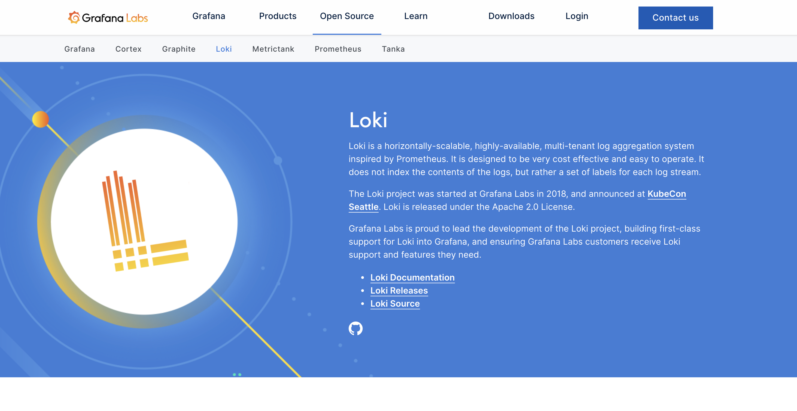

---?image=assets/img/loki_log_panel.png&size=90%

---

### Tracing

---


Note:

- Most costly but richest

---

[jaeger @fa[external-link]](https://www.jaegertracing.io/)

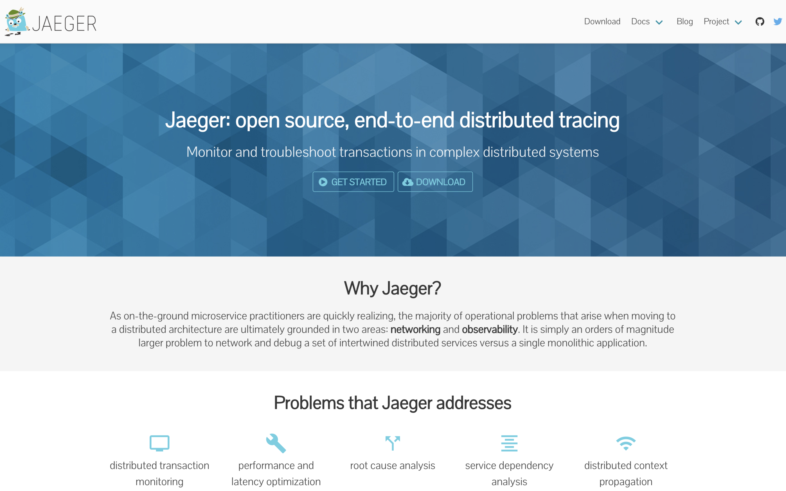

---

```golang
// Create and install Jaeger export pipeline.
traceProvider, closer, err := jaeger.NewExportPipeline(
    jaeger.WithCollectorEndpoint("http://127.0.0.1:14268/api/traces"),
    jaeger.WithProcess(jaeger.Process{
        ServiceName: serviceName,
        Tags: []kv.KeyValue{
            kv.String("exporter", "jaeger"),
        },
    }),
    jaeger.WithSDK(&sdktrace.Config{DefaultSampler: sdktrace.AlwaysSample()}),
)
if err != nil {
    stdlog.Fatalf("failed to initialize tracer, err: %v", err)
}

defer closer()

tracer := traceProvider.Tracer(serviceName)
```

---

```golang
func Receive(logger log.Logger, tracer trace.Tracer) http.HandlerFunc {
	return func(w http.ResponseWriter, r *http.Request) {
		ctx, span := tracer.Start(r.Context(), "receive")
		defer span.End()

        ...

        var reqBuf []byte

		if err := tracer.WithSpan(ctx, "decode", func(ctx context.Context) error {
			var err error
			reqBuf, err = snappy.Decode(nil, compressed)
			return err
		}); err != nil {
			level.Warn(logger).Log("msg", "snappy decode", "err", err)
			http.Error(w, err.Error(), http.StatusBadRequest)

			return
		}
        ...
    }
}
```

---

```golang
func Receive(logger log.Logger, tracer trace.Tracer) http.HandlerFunc {
	return func(w http.ResponseWriter, r *http.Request) {
		ctx, span := tracer.Start(r.Context(), "receive")
		defer span.End()

		...

		var req prompb.WriteRequest

		if err := tracer.WithSpan(ctx, "unmarshal", func(ctx context.Context) error {
			return proto.Unmarshal(reqBuf, &req)
		}); err != nil {
			level.Warn(logger).Log("msg", "proto unmarshalling", "err", err)
			http.Error(w, err.Error(), http.StatusBadRequest)

			return
        }
    }
}
```

---

@snap[north span-100]
#### Power of Middlewares
@snapend

```golang
// Tracer returns an HTTP handler that injects the given tracer and starts a new server span.
// If any client span is fetched from the wire, we include that as our parent.
func Tracer(logger log.Logger, tracer trace.Tracer, name string) func(next http.Handler) http.Handler {
	operation := fmt.Sprintf("/%s HTTP[server]", name)
        ...
		return http.HandlerFunc(func(w http.ResponseWriter, r *http.Request) {
			ctx := r.Context()
			attrs, entries, spanCtx := httptrace.Extract(ctx, r)
			r = r.WithContext(correlation.ContextWithMap(ctx, correlation.NewMap(correlation.MapUpdate{
				MultiKV: entries,
			})))

            ...
		})
	}
}
```

---

```golang
// Tracer returns an HTTP handler that injects the given tracer and starts a new server span.
// If any client span is fetched from the wire, we include that as our parent.
func Tracer(logger log.Logger, tracer trace.Tracer, name string) func(next http.Handler) http.Handler {
	operation := fmt.Sprintf("/%s HTTP[server]", name)
        ...
		return http.HandlerFunc(func(w http.ResponseWriter, r *http.Request) {
			...

			ctx, span := tracer.Start(
				trace.ContextWithRemoteSpanContext(ctx, spanCtx),
				name,
				trace.WithAttributes(attrs...),
			)
			defer span.End()

			span.AddEvent(ctx, operation)

			next.ServeHTTP(w, r.WithContext(ctx))
		})
	}
}
```

---?image=assets/img/jaeger_ui.png&size=90%

---?image=assets/img/jaeger_thanos.png&size=90%

---?image=assets/img/jaeger_thanos_detail.png&size=80%

---

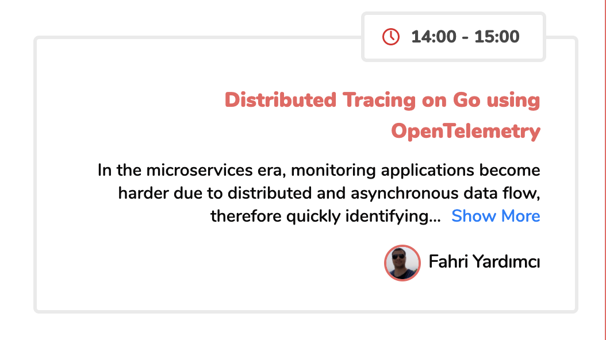

Note:

- There is another talk today dedicated to tracing
- If you are interested I highly recommend

---

### Profiling

Note:

- Last but not least
- Not a pillar but sometimes the most helpful
- Getting the snaphots of used resources from a running system

---

```golang
func main() {
    debug := os.Getenv("DEBUG") != ""
    if debug {
        runtime.SetMutexProfileFraction(cfg.debug.mutexProfileFraction)
        runtime.SetBlockProfileRate(cfg.debug.blockProfileRate)
    }
}
```

---

```golang
import "net/http/pprof"

// Internal server to expose introspection APIs.
mux := http.NewServeMux()

// Register pprof endpoints.
mux.HandleFunc("/debug/pprof/", pprof.Index)
mux.HandleFunc("/debug/pprof/cmdline", pprof.Cmdline)
mux.HandleFunc("/debug/pprof/profile", pprof.Profile)
mux.HandleFunc("/debug/pprof/symbol", pprof.Symbol)
mux.HandleFunc("/debug/pprof/trace", pprof.Trace)
```

---?image=assets/img/pprof_debug.png&size=80%

---

[Profiling Go with pprof @fa[external-link]](https://jvns.ca/blog/2017/09/24/profiling-go-with-pprof/)


Note:

- More on this

---

### Continues Profiling

Note:

- Why?
- Before explaining how you can use the profiler in production, it would be helpful to explain why you would ever want to profile in production.
- Some very common cases are:
- Debug performance problems only visible in production.
- Understand the CPU usage to reduce billing.
- Understand where the contention cumulates and optimize.
- Understand the impact of new releases, e.g. seeing the difference between canary and production.
- Enrich your distributed traces by correlating them with profiling samples to understand the root cause of latency.

---

[Continues Profiling Go Programs @fa[external-link]](https://medium.com/google-cloud/continuous-profiling-of-go-programs-96d4416af77b)

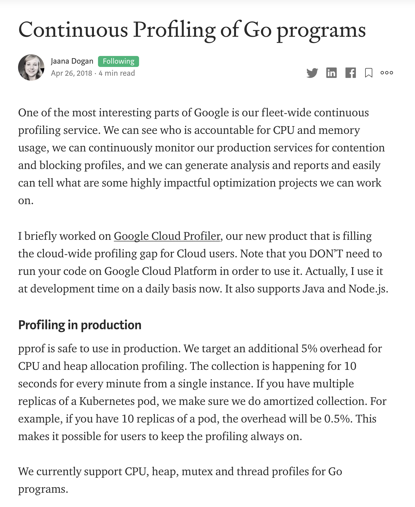

---

[Conprof @fa[external-link]](https://github.com/conprof/conprof)

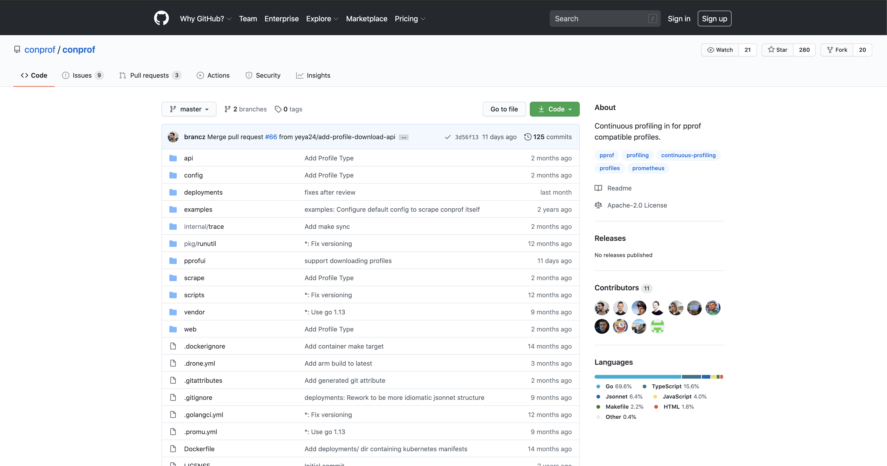

---?image=assets/img/conprof_ui.png&size=80%

---?image=assets/img/conprof_thanos.png&size=80%

---

### **Correlation**: Observability Superpower

---?image=assets/img/lifecycle_with_background.png&size=80%

Note:

- We use Prometheus, an open source monitoring for alerting on time-series.
- Our infrastructure runs on OpenShift, Red Hat’s distribution of Kubernetes.
- Kubernetes (and thus OpenShift) provides us with a simple API to read plaintext logs from our containers.
- To visualize and analyze latencies between and within individual parts of the infrastructure we use an open source distributed tracing tool Jaeger.
- And last but not least each of our processes exposes a pprof (the built-in profiles in the go runtime, but also available for rust, python, nodejs and java) endpoint for profiling, and we use Conprof to continuously collect profiles over time.

---?image=assets/img/correlation_metrics.png&size=80%

Note:

- We took advantage of the tooling we had at hand, to debug the problem, rather than rolling back to the previous version.
- This helped us pinpoint the exact problem and resolved the situation.
- This kind of situation could happen on any project, even in house product systems, where similar workflows could be applied.

---

```console
ts=2020-06-04T10:59:57.6170538Z component=query-reader msg="request finished" trace-id=23957fb8181c10d4
Log line from a slow query log, showing a trace ID from a slow query.
```

Note:

- We checked our slow query logs, of our component that first accepts the requests for queries, which immediately revealed a trace ID to us.
- Any query with latency higher than 5 seconds is written to the slow query log.

---?image=assets/img/correlation_tracing.png&size=80%

Note:

- With this Trace ID, we could immediately pull up a trace in Jaeger of a problematic query.
- This was interesting because we could clearly tell that the overwhelming majority of the query was spent in the query engine,
- and even more importantly, we knew exactly at what time, and which process was crunching away.

---?image=assets/img/correlation_profiles.png&size=80%

Note:

- We in addition to metrics, logs, and tracing continuously profile all processes we run with Conprof.
- With the information available from the trace, we could immediately query Conprof.

---?image=assets/img/correlation_pprof.png&size=80%

Note:

- And pull up a CPU profile from exactly that point in time, and lo and behold, we knew where the majority of CPU time was spent.
- Discovering this allowed us to cut ⅓ in query latency in Thanos.
- Only the combination of tools and correlating the information made this possible.
- The entire troubleshooting process took 2 minutes to find,
- for something that used to take up to days of searching for the needle in the haystack.
- While it is a bit of upfront effort to instrument applications with metrics, logging, and tracing, as this post hopefully shows,
- this effort pays off exponentially.

---

### Grafana

Note:

- TODO

---

[Grafana @fa[external-link]](https://play.grafana.org/)

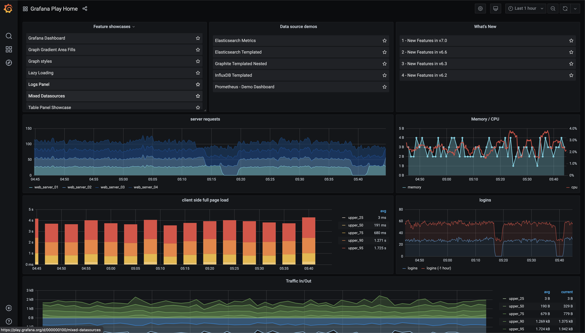

---

[prometheus-datasource @fa[external-link]](https://grafana.com/docs/grafana/latest/features/datasources/prometheus/)

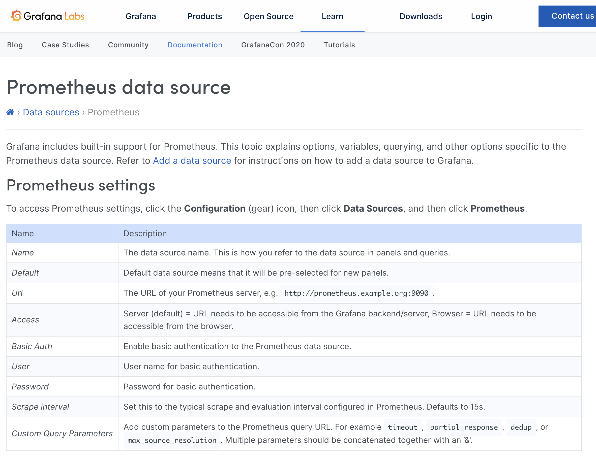

---

[loki-datasource @fa[external-link]](https://grafana.com/docs/grafana/latest/features/datasources/loki/)

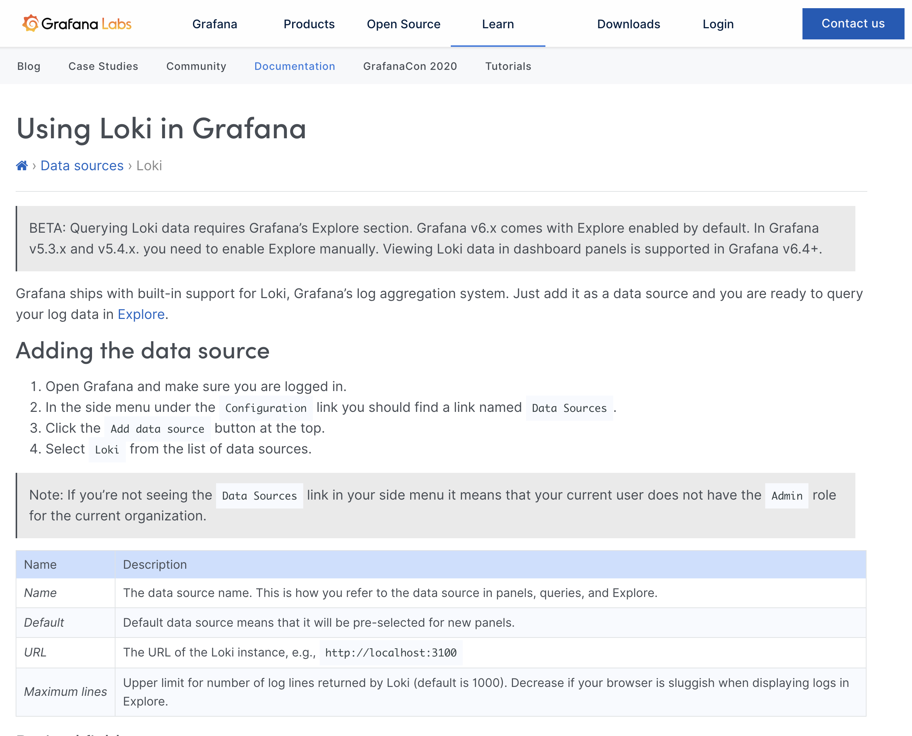

---

[jaeger-datasource @fa[external-link]](https://grafana.com/docs/grafana/latest/features/datasources/jaeger/)

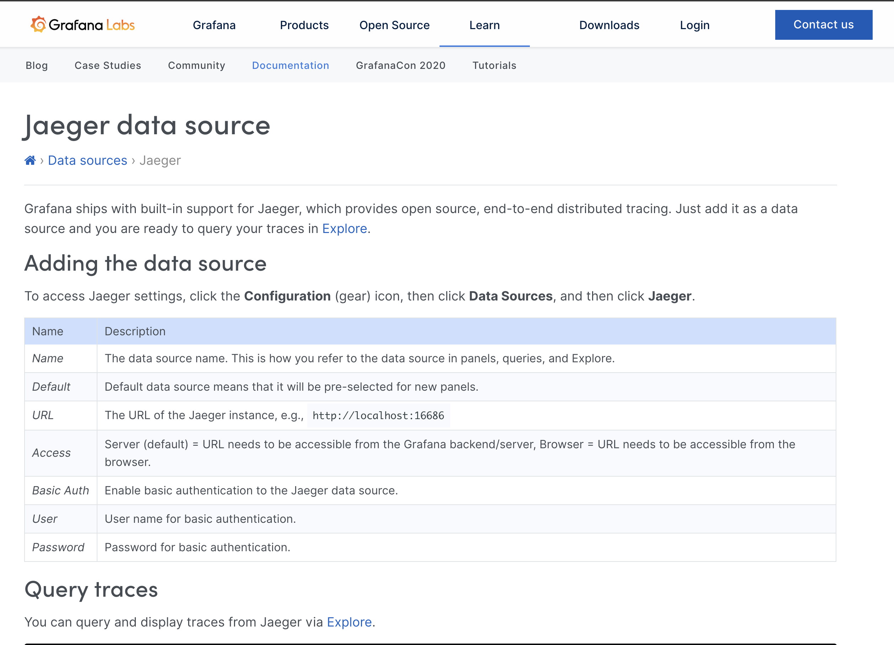

---

### Soon **Conprof** datasource

[conprof-datasource @fa[external-link]](https://github.com/yeya24/conprof-datasource)

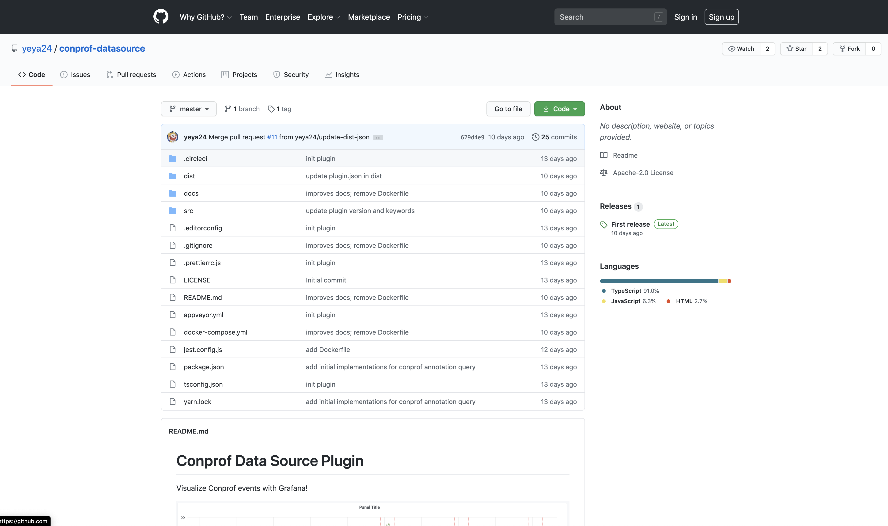

---

### **Check it** yourself

[observable-remote-write @fa[external-link]](https://github.com/kakkoyun/observable-remote-write)

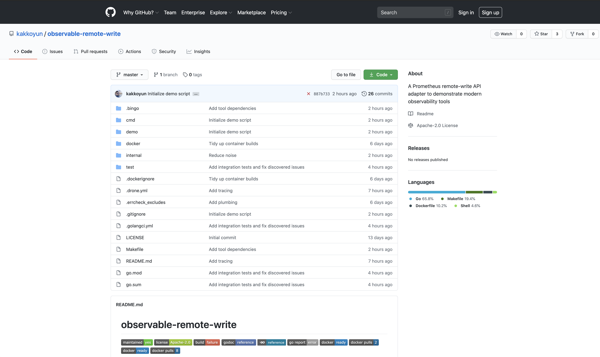

Note:

- *Check it* yourself and tell me what you think
- We can discuss the ideas to improve these patterns and come up with good reusable libraries

---?image=assets/img/soldering.png&position=left&size=60% 100%

@snap[north-east span-60]

### Thanks a lot

@snapend

@snap[east span-30]

@snapend

Note:

- That's it from me :)

---?image=assets/img/red_hat_white.png&size=60%
